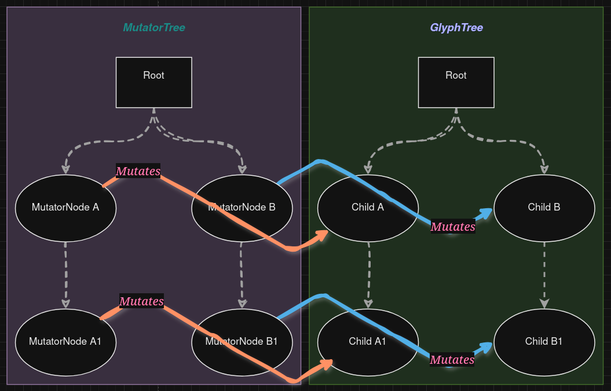
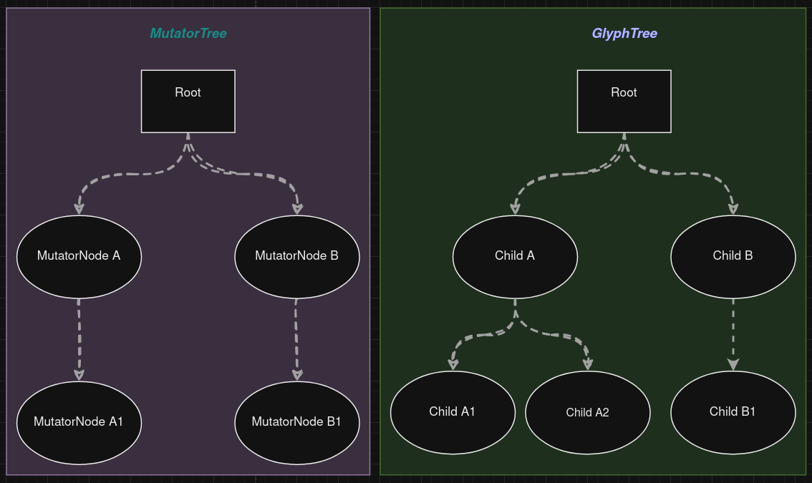
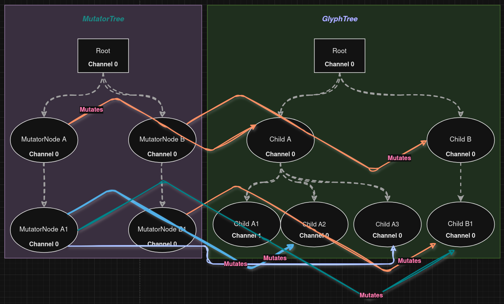
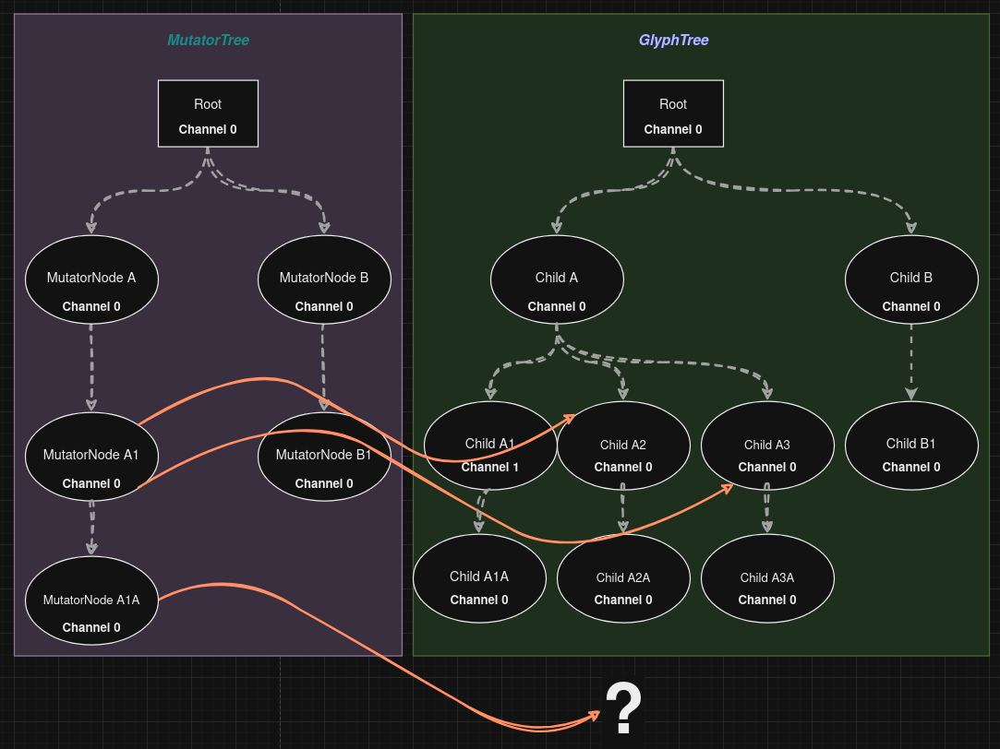
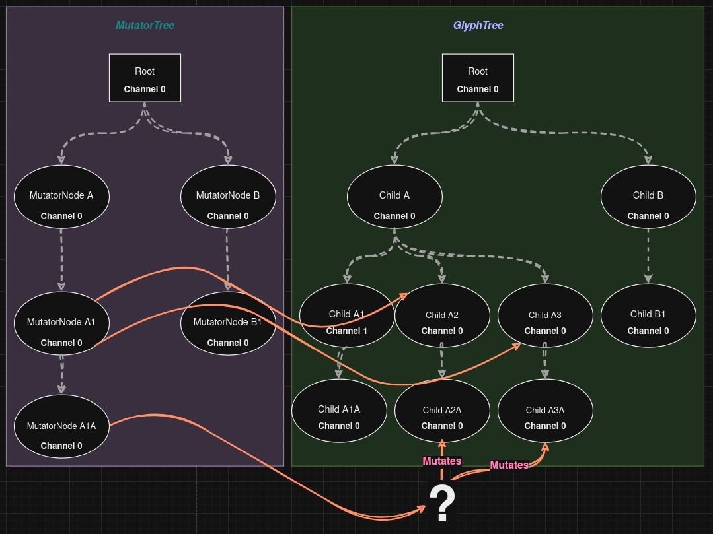
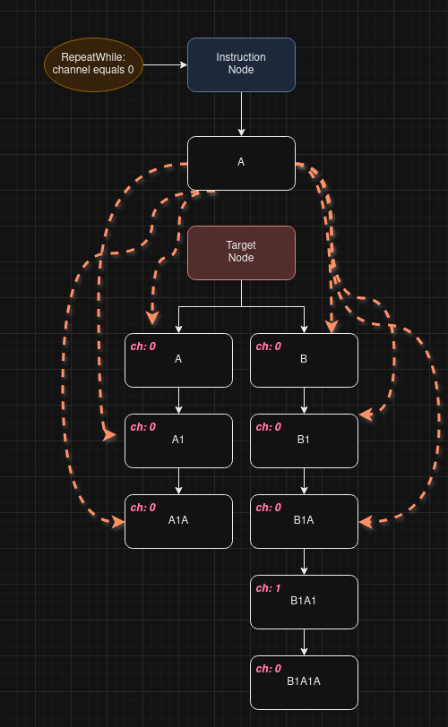
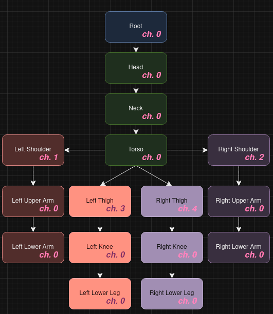
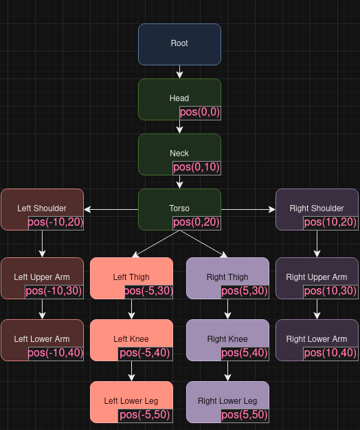
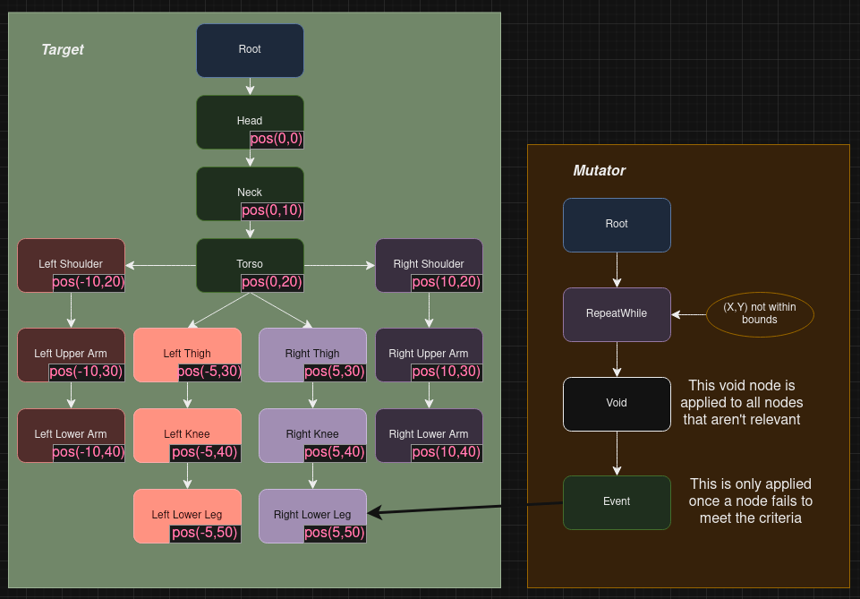

# Mutators

As the project is increasing in complexity I am starting to struggle to hold all concepts in mind, in particular those that are recently introduced and under development. 
For that reason I am writing this document to discuss the abstractions and concepts of the Mutators and of course their relationship with Glyph Trees.

## Glyph-trees and mutator-trees
In its simplest form, a mutator or MutatorTree mirrors the GlyphTree that it intends to mutate. Each node of the mutator-tree corresponds to a node in the target.
Any diff between the mutator and the target will be ignored, so it's okay if the mutator and the target have different structures. But only the "structural intersection"
of the two will be subject to relevance during a mutation. 


### Channels

As long as the mutator and the target have the same structure it is straight-forward, but when they are
different from each other, it quickly becomes desirable to define some simple logic in order to guide the mutation.
Take a look at figure 2 below, where the target has gotten a new node under Child A; Child A2. It is not obvious
which nodes MutatorNode A1 should or shouldn't mutate:



From the figure above it may seem obvious that the MutatorNode A1 should mutate Child A1, and not Child A2
in the target. But the nodes are named in the figure just to help us discuss them, they have no names programmatically.
Or one could match mutator nodes and target nodes by the order that they were added to the tree, in which case
MutatorNode A1 would indeed mutate Child A1.

But this approach is tedious to work with, since the order in which you construct the trees then becomes an essential part of 
how they function. So instead we have introduced a concept of 'Channel' that defaults to 0. 
Without panic, take a look at messy figure 3:



Each node now has a channel, most are the default channel 0. Child A now has 3 children for demonstration purposes,
one of which is channel 1. The orange mutations are not important here, look at the mutations for node A1.
A1 is channel 0, it will still only affect target nodes that are on the same level of the tree hierarchy, but among
those, it will also only affect nodes of the same channel. But it will affect all nodes of the same channel, as long as they
are on the same level in the tree. So MutatorTree's A1 mutates target A2 and A3, but skips A1.

### Descending the trees
Let's expand the tree a little bit more with figure 4, to show an important part of how tree-mutation works on Baumhard.
Now MutatorTree has a new node which is a child of A1, and the target GlyphTree has three new nodes, 
all of which have channel 0, same as our new mutator node:




The way Baumhard works is that when the mutator A1 node is matched with target nodes A2 and A3,
the mutating A1 node and all of its children will be applied as a MutatorTree to the relevant target subtree.
In other words, Child A1A will not be mutated by the mutator A1A, because their parent nodes did not match. 
So target Child A1A will never be considered for mutation, but both Child A2A and Child A3A will be mutated by
mutator node A1A:



This detail is crucial to understanding how the two trees are descended in sync during mutation. This concludes the most
basic albeit limited functionality of Baumhard. Now we will start looking at how mutations can be made to be
smarter, or obey simple logic.

### Instructions
Instruction nodes are special mutation nodes that may, but also may not contain a normal mutation-node which
would be applied to its target. In addition, the instruction node contains a special instruction on how the *children*
nodes of the instruction node should be applied to the *children* nodes of the target:



In this simple example, we have an instruction node with a RepeatWhile instruction. The RepeatWhile has a predicate, which
in this case is "channel equals 0", the most basic kind of predicate. The channels of the instruction-node's child(ren)
are ignored, and the predicate takes full precedence. As per now there are only two types of instructions; 
RepeatWhile and RotateWhile, but more may be added of course. First and foremost, instructions allows to target several
target nodes using predicates. As far as tree-mutation goes, we have now covered the conceptual basics. 

### Types of Mutations
GfxMutator is the basic mutator node, and can be of different types:

```Rust
pub enum MutatorType {
    Single,
    Macro,
    Void,
    Instruction,
}
```
A 'Single' simply means that the mutator contains a single mutation, while a macro is a list of mutations. 
The rest of the types have been covered above. Mutations can also be different types, as per right now we have
these types:

```Rust
pub enum Mutation {
    AreaDelta(Box<DeltaGlyphArea>),
    AreaCommand(Box<GlyphAreaCommand>),
    ModelDelta(Box<DeltaGlyphModel>),
    ModelCommand(Box<GlyphModelCommand>),
    Event(GlyphTreeEventInstance),
    None,
}
```
Let's focus on the four first types for a bit. We have two kinds of mutations for each target type; one "delta" mutation
and one "command" mutation. These are just two ways to achieve the same things, none of them have exclusive capabilities.
A *delta mutation* involves defining a series of fields that corresponds to the targets fields, and applying some kind of 
delta operation on them, like subtraction or multiplication. A *command mutation* on the other hand offers pre-defined mutations
that may (or not) take a set of parameters. It's not essential to understand the difference between them in order to use them - 
it will very soon become apparent. What's important is to be aware that there are different types of mutations, particularly important
to note that they might (and usually do) apply to different kinds of targets.

You can not apply a ModelDelta or ModelCommand mutation to a GlyphArea.
You can not apply a AreaDelta or AreaCommand mutation to a GlyphModel. Thus this is a potential gap for subtle bugs to enter, 
however it is never an error to apply these to wrong targets, it will be silently ignored by Baumhard, by design.

Next, we will look at the special Event mutation, which is strictly speaking not *really* a mutation, but rather uses the 
*mutator infrastructure* to achieve its goals. It is technically a mutation yes, but not conceptually.

## Events and flags
If what you want to create only involves mutation, or animation of the glyph models, then the above tools should offer
every capability you need. But if you want a reactive application that can respond to input and maintain states beyond
the state of the actual model itself, you will need more tools. Baumhard handles this through *events* and *flags*. 

### Events

- *Event*: ***Does not explicitly alter the state of its target, but allows the target to react to the event***


- *Mutation*: ***Explicitly alters the state of its target***

Applied just like any mutation, an *Event* mutation contains a struct called GlyphTreeEventInstance.
This just contains a timestamp for the event, and a GlyphTreeEvent, which is an enum type that defines the
basic events that one can expect in Baumhard:

```Rust
pub enum GlyphTreeEvent {
    /// Keyboard input events
    KeyboardEvent,
    /// Mouse input events
    MouseEvent,
    /// Events that are defined by the software application
    AppEvent,
    /// The recipient should start preparing to shut down now
    CloseEvent,
    /// The recipient will be terminated any time
    KillEvent,
    // The recipient must call the provided function with its info
    //CallbackEvent(Box<dyn Fn(GlyphNodeInfo)>), impl only if needed
}
```
As per now these events does not contain any further info, that is only because it is not yet implemented
as of writing this. But there is really no need to have those details for the purpose of this guide - 
conceptually speaking this makes sense and that is what matters.

Events allows Baumhard to become reactive to its environment, and uses the infrastructure already in place for
the mutations. 


### Flags
Flagging is another tool that enables Baumhard to store arbitrary state data that is not related to the
glyphs themselves. An obvious example would be a *focused* flag that indicates if the particular component
should be considered focused or not in terms of input. Together with events this allows information and states to
propagate through the glyph models. There are different types of flags:

```Rust
pub enum GlyphTreeFlag {
    Focused,
    Mutable,
    Anchored(AnchorBox),
}
```
As of writing this, only three types have been implemented. The reason to implement specific, and consequently limited flags
is to be able to handle certain ultra-common types of flags natively. Baumhard aims to have native GUI support, so 
we need to handle a lot of typical flags, and we want to handle them as efficiently as possible.
That said, generic and more flexible flags will soon be added, to restrict deliberately is no objective of Baumhard.

### Using Flags and Events
Let's create some visual examples of how flags and events can be used to create reactive Baumhard components.
Take the following model:


Let us say that we want to deliver a MouseEvent to the right lower leg, this can easily be done using a mutator
that simply targets the right lower leg. Or let's say we want to mark the right lower leg as focused, the same thing
goes - it's easy to do this using a specific mutator. But most of the times when dealing with user input, we don't really
know in advance exactly which node we wish to target. Because the user will not necessarily be aware of the individual nodes
but rather the model. 

So what we need is for our model to be able to delegate user input to the relevant node, typically using position of the 
mouse cursor or flags to determine which node should ultimately consume the user input. If the input
is mouse, we will most likely be using some position, but if the input is keyboard we might want to use flags to determine
which nodes are currently focused. Some nodes may not accept user input, and should therefore somehow be 
flagged as inactive. 

Baumhard has native support for targeting nodes based on position, and flags. Meaning that you can send input
to a model, along with data for which node within the model you wish to address, and your input will be
delegated down the tree to the correct node(s).



Given figure 8 above, let's say a user is clicking within the bounds of the right lower leg.
Baumhard does not index the bounds of all nodes, and these are not accessible easily without descending the trees
manually. But it's not too complicated to keep track of the bounds of each object, seeing as one typically needs to 
do this anyway for collision, as long as we can determine what model/object the user are trying to interact with then 
Baumhard can take care of the rest.

### Using RepeatWhile to target the right node
Given the example where the user has clicked somewhere within the bounds of the right lower leg, let's look at how
Baumhard recurses the tree to find the relevant node:



Look at the mutator in figure 9 above. The root node is effectively transient, and its children are applied to 
the children of the target root. RepeatWhile is applied to the Head node, which does nothing except instruct Baumhard
to recurse through the descendants of Head and apply the Void node, until the criterion is no longer met.
The criterion will hold until Right Lower Leg, and lastly the Event node will be applied to Right Lower Leg.

It may be worth mentioning that for a while we also had a SkipWhile instruction which would serve this exact purpose.
However, since the RepeatWhile instruction can be used in the same way, just negated, it was removed in order to simplify.
